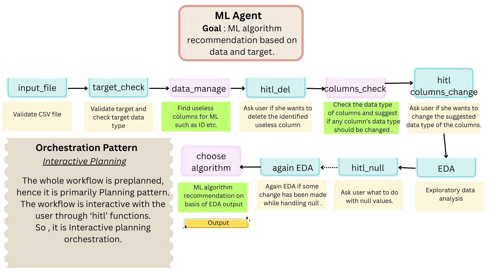
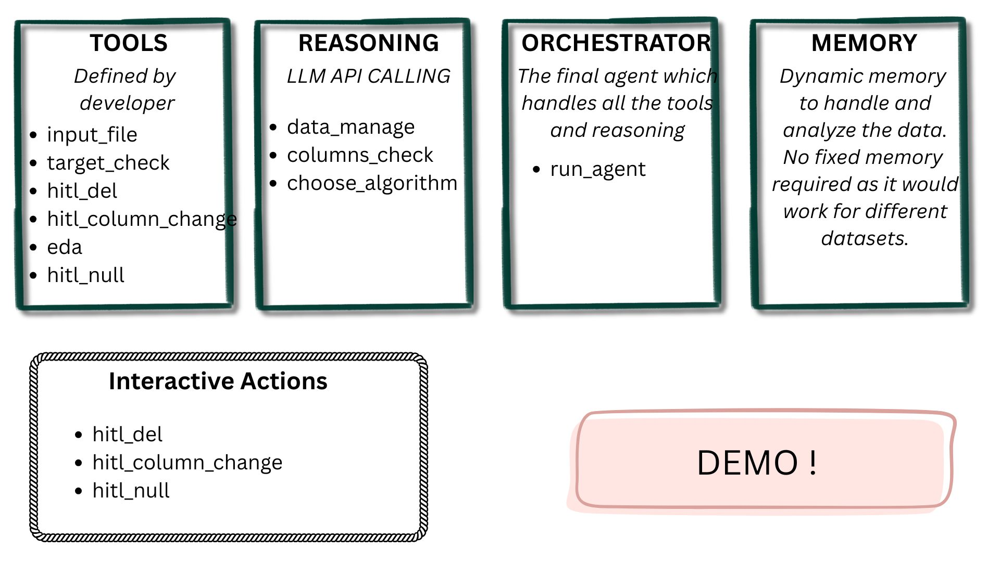

# Machine Learning Agent

An interactive, agentic workflow system designed to analyze datasets and recommend the most suitable Machine Learning algorithms based on input data and specified target variables.

---

##  Project Overview

The **Machine Learning Agent** automates the data preprocessing and Exploratory Data Analysis (EDA) process while actively engaging the user through Human-in-the-Loop (HITL) interactions. By leveraging LLM reasoning and custom developer tools, the agent guides users through data cleaning, feature analysis, and type conversion, concluding with an optimal machine learning algorithm recommendation.

---

##  Orchestration Pattern

The system employs an **Interactive Planning** orchestration pattern. The overall workflow is preplanned, following a structured pipeline while dynamically incorporating human approval and feedback via `hitl_*` (Human-in-the-Loop) steps.

### Workflow Steps:

1. **`input_file`**: Validates the input CSV dataset file.
2. **`target_check`**: Validates the target variable and verifies its data type.
3. **`data_manage`**: Identifies non-informative or useless columns (e.g., IDs, high-cardinality metadata).
4. **`hitl_del`**: Asks the user for confirmation to delete identified redundant columns.
5. **`columns_check`**: Inspects column data types and suggests corrections if any column type is mismatched.
6. **`hitl_columns_change`**: Prompts the user to accept or override recommended data type changes.
7. **`EDA`**: Performs initial Exploratory Data Analysis on the dataset.
8. **`hitl_null`**: Interactively asks the user how to handle missing/null values (e.g., imputation, deletion).
9. **`again EDA`**: Re-runs EDA if changes were made during the null-value handling phase.
10. **`choose algorithm`**: Evaluates the processed dataset and EDA results to recommend the best machine learning algorithm for the target task.

---

##  Architecture & Component Design

The architecture integrates developer-defined tools, LLM-driven reasoning, dynamic memory management, and an orchestrator to manage the end-to-end flow.

### Architectural Components:

* **Developer Tools**: Standard functions executed during pipeline operations.
  * `input_file`, `target_check`, `eda`
* **Interactive Actions (HITL)**: Modules that pause execution to gather user decisions.
  * `hitl_del`, `hitl_column_change`, `hitl_null`
* **Reasoning (LLM API Calling)**: Core AI capabilities used to analyze data characteristics, recommend data type adjustments, and select the best model.
  * `data_manage`, `columns_check`, `choose_algorithm`
* **Orchestrator (`run_agent`)**: Main entry agent that coordinates tool calls, manages human interactions, and controls execution flow.
* **Memory**: Dynamic memory management designed to handle and analyze varying datasets on the fly without requiring persistent fixed storage across different datasets.

---

##  Getting Started

### Prerequisites

* Python 3.8+
* Environment configured with necessary LLM API credentials (e.g., OpenAI / Gemini API keys).

### Usage

1. Clone the repository and install required dependencies.
2. Prepare your CSV dataset and identify your target column.
3. Run the orchestration agent
4. Respond to the interactive prompts (HITL) regarding column deletion, data type adjustments, and missing value handling.
5. Receive the final EDA summary and recommended machine learning algorithm.

---

##  Key Features

* **Human-in-the-Loop (HITL) Controls**: Ensures data scientist oversight at crucial steps (column deletion, type conversion, null handling).
* **Automated Data Cleaning & Type Suggestion**: Uses LLM reasoning to detect irrelevant columns and correct misclassified data types.
* **Dynamic Pipeline Execution**: Re-evaluates data via updated EDA steps based on user choices.
* **Tailored Algorithm Recommendation**: Matches data attributes and target variables with optimal ML algorithms.

---

## Future Roadmap

In upcoming iterations, the Machine Learning Agent will expand beyond single-agent recommendations into a robust **Multi-Agentic System**:

* **Unsupervised Learning Recommendations**: Extend recommendation capabilities to clustering, dimensionality reduction, and anomaly detection for unlabeled datasets.
* **Automated Model Training & Evaluation**: Move from recommending algorithms to automatically training candidate models directly on the processed data.
* **Model Benchmarking & Comparison**: Implement automated cross-validation, hyperparameter tuning, and comprehensive metric comparisons (Accuracy, F1-Score, RMSE, ROC-AUC) to output production-ready models.
* **Multi-Agent Orchestration**: Transition to specialized sub-agents (e.g., Data Prep Agent, Feature Engineering Agent, Training Agent, Evaluation Agent) working collaboratively to execute full ML pipelines.
